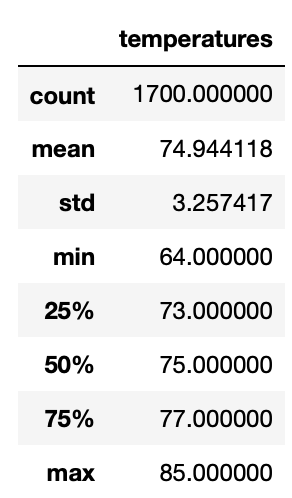
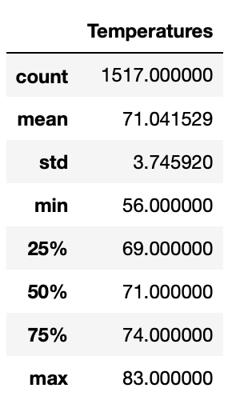

# surfs_up

## Project Overview & Purpose
The purpose of this analysis was to determine the best months to open an ice cream shop in Hawaii based on the temperature trends. I specifically looked at temperature trends in June and December on the island of Oahu to determine whether the shop would be sustainable throughout the year.

## Resources
Software: Python, Jupyter Notebook, SQLite

## Results

### June Analysis:

### December Analysis:

### There are three key differences between the June and December temperature trends:
  * The average temperature in June is higher than in December, with June’s mean temperature of 74.94 degrees and December’s mean temperature of 71.04 degrees.
  * The minimum temperature in June is 64 degrees, which is higher than the minimum temperature of 56 degrees in December.
  * The maximum temperature in June is 85 degrees, which is higher than the minimum temperature of 83 degrees in December.

 

## Summary
Overall, June has higher temperatures than December in Oahu. The average, minimum and maximum temperatures in June are all higher than the same metrics in December. Generally, the temperatures in Oahu are not too cold and seem sustainable for an ice cream shop. Another query that would be beneficial in this analysis would be to measure the rainfall in June and December, as people may be less likely to buy ice cream in the rain than in cold weather. Also, using a query to determine the major rain events during the year (such as a hurricane) would be beneficial to the analysis of when to open an ice cream shop as well.
